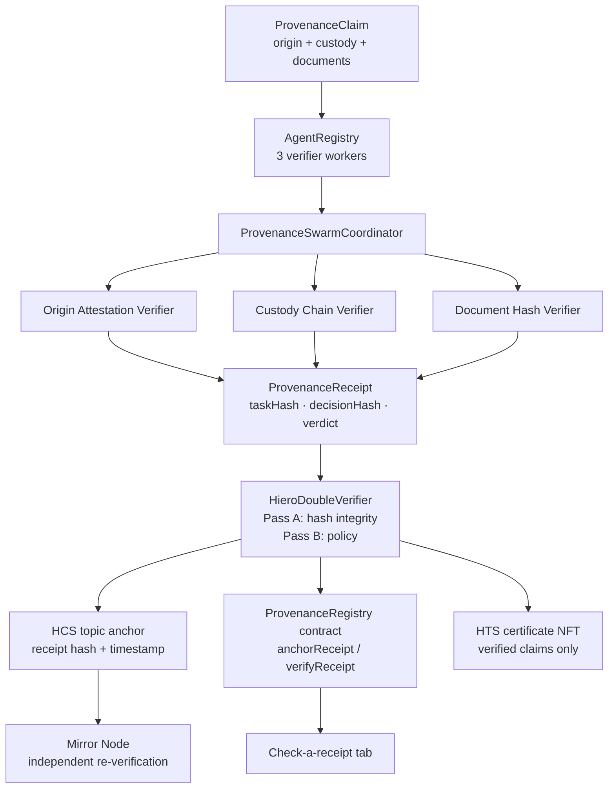

# Provenance Swarm: a Scaffold-HBAR template

Verifiable supply-chain provenance on Hedera. A deterministic agent swarm checks a product's
origin attestation, custody chain, and document hashes; the coordinator binds the verdicts
into a tamper-evident receipt; the receipt can be anchored on Hedera (HCS topic + registry
contract) and a provenance-certificate NFT (HTS) is minted for verified claims. A Next.js
frontend walks anyone through claim to verification to receipt to anchoring, and a third
party can re-check a receipt against the chain or the mirror node without trusting the
verifier.

Scaffold it in one command:

```bash
npm exec --yes create-scaffold-hbar@latest -- --template livevnx8/scaffold-hbar-provenance-swarm --solidity-framework hardhat --package-manager npm
```

The default branch is `main`, so the bare `--template owner/repo` form resolves the
template tarball directly. Pass `--solidity-framework hardhat` and `--package-manager npm`
explicitly so the scaffold does not assume other defaults. (Written with `npm exec`
rather than `npm create` because `create-scaffold-hbar` rewrites `npm <word>` into
`npm run <word>` inside scaffolded markdown files.)

## Why it matters

The swarm pattern separates independently testable verification responsibilities while keeping the final provenance receipt deterministic and reproducible.

### What this does not prove

- **Not real-world truth.** A self-consistent fabricated claim (hashes that recompute and
  match the supplied fields) gets a full GREEN. The system proves internal consistency of
  the fields you supply, not signer identity, source authentication, document retrieval, or
  custody attestation from the outside world.
- **Mirror confirmation is byte equality.** `verifyHcsAnchorOnMirror` checks that the HCS
  payload's `decisionHash` equals the caller-provided expected hash. It does not
  independently reconstruct the claim or recompute provenance.
- **Document hashes are shape-checked only.** The Document Hash Verifier accepts lowercase
  64-char hex strings. It never obtains or hashes document bytes, so it does not authenticate
  document contents.

Supply-chain claims are easy to forge and hard to re-check. This template turns a product
claim into a tamper-evident receipt: the same claim always yields the same worker verdicts,
hashes bind the claim to those verdicts, and Hedera anchors make the receipt independently
replayable. A forged "verified" receipt is refused at the server gate before any HCS,
registry, or NFT write.

## What `npm run demo` shows (~30 seconds after install)

Root script (do **not** use a workspace-scoped demo command; the swarm package exposes
`demo:plan`, and the root wires it):

```bash
npm run demo
```

You should see **GREEN / GREEN / RED**:

1. **GREEN** - valid coffee fixture verifies.
2. **GREEN** - a second valid lot verifies.
3. **RED** - a tampered attestation is refused; the receipt truthfully records
   `needs_review` and the failing worker is named.

The demo also prints the recorded-anchor evidence block (historical HCS seq 2 + NFT serial
#1). UI twin: load the coffee fixture, verify, then click **Tamper attestation** and verify
again to see the refused claim explain itself.

## Quick start (no Hedera account needed)

```bash
npm install          # ~9 minutes on a clean machine; Node >= 20.18.3
npm run build        # builds swarm (dist/) then nextjs; required before `dev`
npm run demo         # GREEN / GREEN / RED offline teach-in
npm test             # workspace unit tests, all offline
```

Run the frontend:

```bash
npm run build        # if you have not already
npm run dev --workspace @provenance-swarm/nextjs    # http://localhost:3000
```

The UI runs fully offline until you add Hedera credentials. The header badge reads
"Offline demo mode" vs "Hedera testnet configured", and the anchor panel explains exactly
what to configure. Click **Load coffee fixture** then **Run verification** for the happy
path; use **Tamper attestation** for the refused path.

## Frozen exhibit: Window 9

Window 9 is a **historical, read-only** research tape on Hedera testnet topic
[`0.0.10569989`](https://hashscan.io/testnet/topic/0.0.10569989). It is **not** the
template's live anchor topic. Template live anchors use `HEDERA_TEMPLATE_TOPIC_ID`
(auto-created when empty). Writing to `0.0.10569989` from template paths is refused.

| Seq | Result | HashScan |
|---|---|---|
| 833 | GREEN (valid) | [tx](https://hashscan.io/testnet/transaction/0.0.9032608@1789868602.323750400) |
| 834 | GREEN (valid) | [tx](https://hashscan.io/testnet/transaction/0.0.9032608@1789869656.328037066) |
| 835 | RED (refused, withheld) | [tx](https://hashscan.io/testnet/transaction/0.0.9032608@1789870540.047570332) |

Pinned identifiers: [`docs/window-9/identifiers.md`](./docs/window-9/identifiers.md).
Narrative PDF: [`docs/window-9/decision-integrity-record.pdf`](./docs/window-9/decision-integrity-record.pdf).

Locked red-line from that record (verbatim):

> This is not “the model failed.” The harness failed the artifact on purpose. The worker was honest; the gate did its job. The red does not count toward n — n stays 2. Do not blur.

## Architecture



## What's inside

```
packages/
  swarm/       Deterministic agent core: workers, coordinator, receipt builder,
               double-verifier, fixture, plus Hedera adapters
               (HCS anchoring, HTS certificate minting, mirror re-verification)
  contracts/   Hardhat: ProvenanceRegistry.sol  -  one-anchor-per-claim registry
               with on-chain lookup and hash verification
  nextjs/      Staged UI (claim → verify → receipt → anchor), receipt inspector,
               third-party "check a receipt" tab, and API routes bridging the
               browser to the swarm core and Hedera
template.json  Scaffold-HBAR manifest — lives at the repo root by design; the CLI reads it from there (it is intentionally not copied into the scaffolded tree)
AGENTS.md      Agent operating notes for this template
```

## How verification works

Every step is deterministic: no models, no randomness, no network calls in the verify path.

1. **Canonicalize and hash the claim** - `taskHash = sha256(canonical claim JSON)`. Any
   byte-level change to the claim changes this hash.
2. **Run the three workers** - each recomputes the hash it is responsible for and compares:
   - *Origin Attestation Verifier* recomputes `sha256(farm|region|harvestDate|statement)`.
   - *Custody Chain Verifier* recomputes each `sha256(prevHolder|holder|receivedAt)` and
     checks the chain links end-to-end.
   - *Document Hash Verifier* checks every document hash is well-formed 64-char hex.
3. **Build the receipt** - `decisionHash = sha256(taskHash + worker results)`. The verdict
   is `verified` only if every worker passes.
4. **Double-verify** - two independent passes must agree: Pass A re-derives both hashes from
   the claim; Pass B checks verdict/worker consistency. A tampered claim is *truthfully
   recorded* as `needs_review`. The receipt never lies about what it saw.
5. **Anchor gate** - `POST /api/anchor` requires the original claim and re-runs
   `verifyProvenanceReceipt` (and a fresh `verifyClaim`) **before** any HCS, registry, or
   NFT write. Forged "verified" receipts are rejected with HTTP 403. Receipts that fail
   verification are never minted an NFT; `needs_review` receipts may still be anchored with
   their verdict truthfully recorded.

## Check-a-receipt honesty

`POST /api/contract-verify` supports two modes:

- **claim-reverified** (preferred): post the claim; the server recomputes `decisionHash`
  before comparing to the registry.
- **hash-equality-only**: post only `claimId` + `decisionHash`. A match proves the registry
  holds that hash for that claim ID (first-writer-wins). It does **not** prove claim
  ownership. The response `note` field says so explicitly.

## Hedera services in play

| Service | Role | Where |
|---|---|---|
| Smart Contract Service | `ProvenanceRegistry` stores `decisionHash` per claim; `verifyReceipt` lets anyone check a presented receipt on-chain | `packages/contracts`, `/api/anchor`, `/api/contract-verify` |
| HCS | Receipt hash anchored as a topic message: public, timestamped proof of existence | `packages/swarm/src/hedera.ts`, `/api/anchor` |
| HTS | Provenance-certificate NFT minted per verified claim, carrying the decision hash | `packages/swarm/src/hedera.ts`, `/api/anchor` |
| Mirror Node | Frontend re-verifies the HCS anchor via public mirror REST; every step links out to HashScan | `packages/swarm/src/mirror.ts`, `/api/mirror-verify` |

### Environment

Copy `packages/nextjs/.env.example` to `packages/nextjs/.env`:

| Variable | Required for | Notes |
|---|---|---|
| `HEDERA_OPERATOR_ID` / `HEDERA_OPERATOR_KEY` | any on-chain step | Testnet credentials only; never commit |
| `HEDERA_KEY_TYPE` | HCS + registry key parsing | `ecdsa` / `ed25519` / empty (auto). **Registry path is ECDSA-only** (ethers `Wallet`); ED25519 keys can still drive HCS/HTS via the SDK but will not sign registry txs. |
| `HEDERA_NETWORK` | anchoring | `testnet` (default) or `mainnet` |
| `HEDERA_TEMPLATE_TOPIC_ID` | live HCS anchors | auto-created if absent; **must not** be `0.0.10569989` |
| `HEDERA_PROVENANCE_TOPIC_ID` | legacy alias | still honoured if `HEDERA_TEMPLATE_TOPIC_ID` is unset |
| `HEDERA_EXHIBIT_TOPIC_ID` | docs only | defaults to frozen Window 9 topic `0.0.10569989` (read-only) |
| `HEDERA_CERTIFICATE_TOKEN_ID` | NFT mint | **must be set** (or created out-of-band / via `packages/swarm/scripts/mint-genesis-certificate.ts`); **not** auto-created by `/api/anchor`. If unset, `mintCertificate` fails with "No certificate token configured" and the NFT step reports that error |
| `HEDERA_REGISTRY_ADDRESS` | contract anchor + receipt checks | from `deploy:testnet` |
| `HEDERA_RPC_URL` | contract calls | defaults to Hashio testnet |

## Going to testnet

**Prerequisites.** Node >= 20.18.3. First `npm install` on a clean machine can take **~9 minutes**. A Hedera testnet account funded from the
[faucet](https://portal.hedera.com) (a few testnet HBAR covers the topic
create, registry deploy, HCS anchors, and NFT mint), and the registry deployed
before you anchor (step 3). ECDSA operator keys (e.g. HashPack-style accounts)
need `HEDERA_KEY_TYPE=ecdsa` in `packages/nextjs/.env` (the registry path is
ECDSA-only via ethers); raw 32-byte keys cannot be told apart by inspection and
the SDK defaults to ED25519.

**If anchoring fails**, the API returns a plain reason. Incomplete provenance
chains are not accepted as finalized receipts:

- **400** — bad request / unusable key / exhibit topic pointed at live path
  (`Live topic is set to the frozen Window 9 exhibit topic`,
  `HEDERA_OPERATOR_KEY is not a usable private key for the registry path`).
- **500** — server misconfig (`Hedera operator not configured`).
- **409** — duplicate registry anchor (`This claim is already anchored on-chain`).
- **502** — partial or all-failed HCS / registry / NFT stages (`{ ok: false }` plus
  per-stage results). Skipped stages (no registry / non-verified NFT) are not failures.
- `No certificate token configured` surfaces as a failed NFT stage (502 when the
  mint was attempted); set `HEDERA_CERTIFICATE_TOKEN_ID` — the anchor path does not
  auto-create the NFT collection.
- Registry path is **ECDSA-only**; set `HEDERA_KEY_TYPE=ecdsa` for HashPack-style keys.

1. Create a testnet account via the [Hedera Portal](https://portal.hedera.com) and fund it from the faucet.
2. Copy `packages/nextjs/.env.example` to `packages/nextjs/.env` and add your operator credentials.
3. Deploy the registry: `npm run deploy:testnet --workspace @provenance-swarm/contracts`
4. Run the full claim flow in the frontend: verify → anchor → verify on mirror node.
5. Record the transaction hashes below.

**Verified testnet transactions**

Historical Window 9 exhibit (read-only tape on topic `0.0.10569989`; full notes:
[`genesis-nft/LIVE_RUN.md`](./genesis-nft/LIVE_RUN.md)):

| Step | Transaction | HashScan link |
|---|---|---|
| Receipt anchor (HCS) | `0.0.9032608@1789565505.352869642` (topic `0.0.10569989`, seq 2) | [transaction](https://hashscan.io/testnet/transaction/0.0.9032608@1789565505.352869642) · [topic](https://hashscan.io/testnet/topic/0.0.10569989) |
| Certificate NFT mint (HTS) | `0.0.9032608@1789565511.702573940` (token `0.0.10569997`, serial #1) | [transaction](https://hashscan.io/testnet/transaction/0.0.9032608@1789565511.702573940) · [token](https://hashscan.io/testnet/token/0.0.10569997) |

**Live template path** (2026-09-21 E2E; operator `0.0.9034044`; topic ≠ exhibit; evidence:
[`docs/e2e/E2E-TESTNET-2026-09-21.md`](./docs/e2e/E2E-TESTNET-2026-09-21.md)):

| Step | Transaction | HashScan link |
|---|---|---|
| Registry deployment | `ProvenanceRegistry` at `0xC9231fa293113991285ed41b60906Dfb0E2CDC01` | [contract](https://hashscan.io/testnet/contract/0xC9231fa293113991285ed41b60906Dfb0E2CDC01) |
| Template topic (live) | `0.0.10649257` (auto-created; **not** `0.0.10569989`) | [topic](https://hashscan.io/testnet/topic/0.0.10649257) |
| Receipt anchor (HCS) | `0.0.9034044@1789999996.558665178` (topic `0.0.10649257`, seq 3) | [transaction](https://hashscan.io/testnet/transaction/0.0.9034044@1789999996.558665178) |
| Registry `anchorReceipt` | `0xb3513ef3b0394b4a80d65b46d07ea78fa988a21668df4549267a3d8202e66ecd` | [transaction](https://hashscan.io/testnet/transaction/0xb3513ef3b0394b4a80d65b46d07ea78fa988a21668df4549267a3d8202e66ecd) |
| Certificate collection | token `0.0.10649238` (PROVC) | [token](https://hashscan.io/testnet/token/0.0.10649238) |
| Certificate NFT mint (HTS) | `0.0.9034044@1790000007.430466835` (serial #1) | [transaction](https://hashscan.io/testnet/transaction/0.0.9034044@1790000007.430466835) |
| Mirror re-verify | decisionHash match on seq 3 | [mirror message](https://testnet.mirrornode.hedera.com/api/v1/topics/0.0.10649257/messages/3) |
| Forged `/api/anchor` | tampered decisionHash → HTTP **403** | refused (no write) |

## API routes (frontend backend)

| Route | Purpose |
|---|---|
| `POST /api/verify` | Runs the swarm over a claim; returns `{ receipt, report }` (fully offline) |
| `POST /api/anchor` | Re-verifies claim+receipt, then anchors: HCS topic message, registry record, HTS certificate mint |
| `POST /api/contract-verify` | Third-party check: hash-equality-only, or claim-reverified when a claim is posted |
| `POST /api/mirror-verify` | Re-fetches the HCS topic message from the mirror node and compares decision hashes |
| `GET /api/config` | Which Hedera features are configured (no secrets leak to the browser) |
| `GET /api/fixture` | The valid coffee-shipment fixture claim |

## Testing

```bash
npm test --workspace @provenance-swarm/swarm       # workers, coordinator, receipts,
                                                   # double-verifier, mirror helper (stubbed fetch)
npm test --workspace @provenance-swarm/contracts   # anchor/lookup/verify, one-anchor rule
npm run build --workspace @provenance-swarm/nextjs  # production build must compile clean
```

## Honest boundaries

- The verifier workers are **deterministic scoring logic**, not AI models. The "agent swarm"
  framing refers to the worker/coordinator/registry architecture with verifiable receipts.
- Live Hedera behavior was validated on testnet (see the E2E evidence table above). Offline
  paths remain covered by the credential-free unit suites.
- The double-verifier is two independent verification *passes* over the same receipt, not
  two independent external systems. When it reports "accepted" on a `needs_review` receipt,
  that means the receipt is authentic and truthfully records `needs_review`, not that the
  claim is verified.
- Hash-chained receipts and mirror re-verification are solid engineering, not novel
  cryptography.
- Topic `0.0.10569989` is the frozen Window 9 exhibit. Template live anchors use
  `HEDERA_TEMPLATE_TOPIC_ID`.
- Self-consistent fabricated claims get full GREEN: workers prove hash recomputes match the
  supplied fields, not real-world truth (no signer identity, source auth, document retrieval,
  or external custody attestation).
- Mirror confirmation (`verifyHcsAnchorOnMirror`) is byte equality of the HCS payload's
  `decisionHash` with the caller-provided expected hash, not independent claim reconstruction.
- `DocumentHashWorker` validates hash *shape* (lowercase 64-char hex) only; it never obtains
  or hashes document bytes.
- `HEDERA_CERTIFICATE_TOKEN_ID` is required for NFT mint. Unlike the HCS topic (auto-created
  via `ensureTopic` when absent), `/api/anchor` does not call `createCertificateToken()`.
  Unset token → mint fails with "No certificate token configured".
- Auto-created HCS topics have a **null submit key**: anyone who knows the topic id can
  append messages. That is intentional for a public receipt tape in this template, not a
  private channel — set your own submit key out-of-band if you need append restriction.

## License

MIT. See [LICENSE](./LICENSE).
