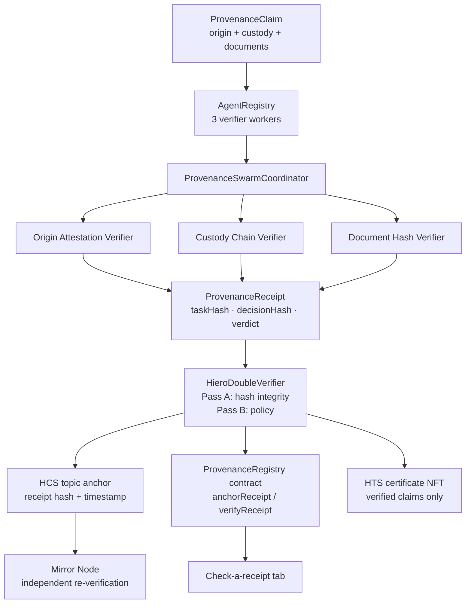

# Provenance Swarm: a Scaffold-HBAR template

> **Naming note:** "swarm" here means a multi-agent verification swarm (independent
> checker agents that vote on a claim). It is not the Swarm RWA tokenization protocol.

Verifiable supply-chain provenance on Hedera. A deterministic agent swarm checks a product's
origin attestation, custody chain, and document hashes; the coordinator binds the verdicts
into a tamper-evident receipt; the receipt can be anchored on Hedera (HCS topic + registry
contract) and a provenance-certificate NFT (HTS) is minted for verified claims. A Next.js
frontend walks anyone through claim to verification to receipt to anchoring, and a third
party can re-check a receipt against the chain or the mirror node without trusting the
verifier.

## The 90-second path (start here)

Read in order. Everything after this section is extension material: cross-chain
attestations, the value oracle, and the universal checker all build on the pattern
below, and none of them is needed to judge it. (A historical research appendix lives
in `docs/history/`.)

**1. Scaffold it.** One non-interactive command, copy-paste ready. The positional
project name plus `--ci` keep the CLI from hanging on prompts; this is the exact
form that passed the gate transcript in
[`docs/e2e/CLI-SCAFFOLD-GATE-2026-09-24.md`](./docs/e2e/CLI-SCAFFOLD-GATE-2026-09-24.md):

```bash
npm create scaffold-hbar@latest -- my-provenance-swarm \
  --template livevnx8/scaffold-hbar-provenance-swarm \
  --ci --package-manager npm --solidity-framework hardhat
```

The scaffold creates a `my-provenance-swarm/` directory; `cd` into it before step 2.

The default branch is `main`, so the bare `--template owner/repo` form resolves the
template tarball directly. `--solidity-framework hardhat` and `--package-manager npm`
match this template's tested setup; `--ci` runs the scaffold without prompting.

**2. Run the demo.** No Hedera account needed. From the repo root (do not run it
workspace-scoped: the oracle package names its script `demo:plan`; the root `demo` script
wires it up):

```bash
npm install   # ~9 minutes on a clean machine; Node >= 20.18.3
npm run build # builds the workspace packages; required once
npm run demo  # ~30 seconds, fully offline
```

You see **GREEN / GREEN / RED / RED-value**:

1. **GREEN**: a valid coffee-shipment claim verifies.
2. **GREEN**: a second valid lot verifies.
3. **RED**: a tampered attestation is refused; the receipt truthfully records
   `needs_review` and names the failing worker.
4. **RED-value**: a claim declaring a 100x USD equivalent against its HBAR amount is
   refused by the value-attestation worker, which recomputes the implied USD value from a
   pinned Chainlink round (a recorded real testnet round, so the demo stays deterministic
   and offline) and fails the 0.5x-2x band.

**3. Tamper a claim.** Supply-chain claims are easy to forge and hard to re-check. This
template turns a product claim into a tamper-evident receipt: the same claim always yields
the same worker verdicts, hashes bind the claim to those verdicts, and a tampered claim
can never silently become verified. The receipt refuses to lie: it records `needs_review`
with the refusing worker named. Try it in the UI: load the coffee fixture, verify, then
click **Tamper attestation** or **Tamper value** and verify again to watch the refused
claim explain itself.

**4. Anchor the verified receipt.** A verified receipt anchors three ways on Hedera
testnet: the receipt goes out as an HCS topic message, the `decisionHash` is stored per
claim in the `ProvenanceRegistry` smart contract (one anchor per claim; duplicates
refused), and a provenance-certificate NFT (HTS) is minted for verified claims only.
`needs_review` claims anchor the refusal but mint nothing. A forged "verified" receipt is
refused at the server gate before any HCS, registry, or NFT write (HTTP 403).

**5. Open HashScan.** The live testnet evidence is documented with links under
[Going to testnet](#going-to-testnet): registry deployment, HCS anchors,
`anchorReceipt` calls, NFT mints, and mirror re-verification, from two independent
operators on 2026-09-23.

**6. Check the receipt from an independent path.** Anyone with the claim ID can replay the
check without trusting the app: re-fetch the HCS message from the public mirror node and
byte-compare the `decisionHash` (`/api/mirror-verify`), call `verifyReceipt` on the
registry contract on-chain (`/api/contract-verify`), or use the app's **Check a receipt**
tab. That is the whole core pattern: deterministic receipt, Hedera anchor, independent
re-check.

## Why it matters

The swarm pattern separates independently testable verification responsibilities while keeping the final provenance receipt deterministic and reproducible.

### What this does not prove

- **Not real-world truth.** A self-consistent fabricated claim (hashes that recompute and
  match the supplied fields) gets a full GREEN. The system proves internal consistency of
  the fields you supply, not signer identity, source authentication, document retrieval, or
  custody attestation from the outside world.
- **Mirror confirmation is byte equality.** `verifyHcsAnchorOnMirror` checks that the HCS
  payload's `decisionHash` equals the caller-provided expected hash. It does not
  independently reconstruct the claim or recompute provenance.
- **Document hashes are shape-checked only.** The Document Hash Verifier accepts lowercase
  64-char hex strings. It never obtains or hashes document bytes, so it does not authenticate
  document contents.

## Advanced extensions (read after the path above)

Everything here builds on the core pattern; none of it is required to judge it.

- **Cross-chain attestations (XRPL, Solana).** The same proof envelope (claim ID, verdict,
  decision hash, task hash, HCS sequence, consensus timestamp) is attested on XRPL and
  Solana devnets as memo-carrying transactions whose payloads byte-match the Hedera
  anchor. Field-proven scripts live in `packages/anchors/scripts/`. See
  [`docs/multi-ledger-anchors.md`](./docs/multi-ledger-anchors.md).
- **Chainlink value-attestation oracle.** A worker recomputes a claim's implied USD value
  from a pinned Chainlink round and enforces a 0.5x-2x band; the demo's RED-value act
  exercises it against a recorded round, offline. See `packages/oracle/`.
- **Universal checker.** One script takes any attestation, an XRPL hash or a Solana
  signature, re-reads the foreign transaction, decodes the envelope, and back-checks every
  field against Hedera. The app's **Check a receipt** tab exposes it through the
  AttestationChecker panel, which prefills real 2026-09-23 attestation IDs and prints the
  exact checker command to run; the panel does not execute the foreign-ledger read in the
  browser. See `packages/anchors/scripts/`.
- **Historical research appendix.** A frozen, read-only research tape on Hedera testnet
  topic `0.0.10569989`; template live paths refuse to write to it. Exhibit at
  [`docs/history/window-9/appendix.md`](./docs/history/window-9/appendix.md).

## How the infrastructure fits together

Five layers, each independently checkable. Layers 1-3 are the core pattern from the
90-second path; layers 4-5 are advanced extensions. A judge can start at any layer and
verify it without trusting the others.

**1. The swarm (offline, deterministic).** Three worker agents check one claim
each: origin attestation (do the hashes recompute from the supplied fields?),
custody chain (is every handoff intact?), document hashes (are they well-formed
64-char hex?). The coordinator binds the three verdicts into a receipt.
`taskHash = sha256(canonical claim)` identifies the claim;
`decisionHash = sha256(canonical {version, taskHash, workers})` binds the
claim to the verdicts. Same claim in, same verdict out: no network, no
randomness, no credentials. A tampered claim verifies to `needs_review` with
the refusing worker named, and the receipt records that truthfully.

**2. Hedera anchors (the trust root).** A verified receipt is anchored three
ways on Hedera testnet: the receipt goes out as an HCS topic message, the
`decisionHash` is stored per claim in the `ProvenanceRegistry` smart contract
(which enforces one anchor per claim and refuses duplicates), and a
provenance-certificate NFT (HTS) is minted for verified claims only.
`needs_review` claims anchor the refusal but mint nothing.

**3. Mirror re-verification (trust, but re-read).** The frontend re-fetches the
HCS message from the public mirror node and byte-compares the `decisionHash`.
Anyone with the claim ID can replay this check from any machine. The chain
is the source of truth, not the app.

**4. Cross-chain attestations (extension: the receipt travels).** The same proof envelope
(claim ID, verdict, decision hash, task hash, HCS sequence, consensus
timestamp) is attested on XRPL and Solana: memo-carrying transactions whose
payloads byte-match the Hedera anchor. Field-proven scripts live in
`packages/anchors/scripts/`.

**5. The universal checker (extension).** One script takes any attestation, an XRPL hash or
a Solana signature, re-reads the foreign transaction, decodes the envelope, and back-checks every field against Hedera: HCS message,
registry `verifyReceipt`, Chainlink oracle for value claims. 12 checks per
attestation, 13 for value claims. If anything drifts, it fails loudly.

## Quick start (no Hedera account needed)

```bash
npm install          # ~9 minutes on a clean machine; Node >= 20.18.3
npm run build        # builds swarm, anchors, oracle, then nextjs; required before `dev`
npm run demo         # GREEN / GREEN / RED / RED-value offline teach-in
npm test             # workspace unit tests, all offline
```

Build ordering matters: `nextjs` and `oracle` import the swarm package's compiled
`dist/`, and the oracle tests import both compiled packages. Root `npm test`
builds swarm + anchors + oracle first via `build:test-deps`, so a clean
checkout works with a single `npm test`. (An earlier `pretest` hook did not
reliably fire under `npm run test --workspaces`, so the build step is now
explicit in the `test` script.) Running `npm test --workspace` on a clean
checkout without a prior build still fails with `MODULE_NOT_FOUND` on the
workspace imports; run root `npm test` or build the three packages first.

Run the frontend:

```bash
npm run build        # if you have not already
npm run dev --workspace @provenance-swarm/nextjs    # http://localhost:3000
```

The UI runs fully offline until you add Hedera credentials. The header badge reads
"Offline demo mode" vs "Hedera testnet configured", and the anchor panel explains exactly
what to configure. Click **Load coffee fixture** then **Run verification** for the happy
path; use **Tamper attestation** for the refused path.

## Frozen exhibit (historical appendix)

A **historical, read-only** research tape on Hedera testnet topic
`0.0.10569989`. It is **not** the template's live anchor topic: live anchors use
`HEDERA_TEMPLATE_TOPIC_ID`, and writes to `0.0.10569989` from template paths are
refused. The full exhibit (sequence table, pinned identifiers, narrative record)
lives in the appendix: [`docs/history/window-9/appendix.md`](./docs/history/window-9/appendix.md).

## Architecture



## What's inside

```
packages/
  swarm/       Deterministic agent core: workers, coordinator, receipt builder,
               double-verifier, fixture, plus Hedera adapters
               (HCS anchoring, HTS certificate minting, mirror re-verification)
  oracle/      Chainlink-style value-attestation oracle: feed readers, deterministic
               verifier, worker pipeline, compositor, runnable demo plan
  anchors/     Multi-ledger evidence anchors: ledger-agnostic anchor interface,
               field-proven XRPL/Solana keyed-run scripts + universal checker
               (packages/anchors/scripts/), fail-closed in-app adapters
  hardhat/     Hardhat: ProvenanceRegistry.sol, the operator-gated
               one-anchor-per-claim registry with on-chain lookup and hash
               verification
  nextjs/      Staged UI (claim → verify → receipt → anchor), receipt inspector,
               third-party "check a receipt" tab (receipts and cross-chain
               attestations), and API routes bridging the
               browser to the swarm core and Hedera
template.json  Scaffold-HBAR manifest. Lives at the repo root by design; the CLI reads it from there (it is intentionally not copied into the scaffolded tree)
AGENTS.md      Agent operating notes for this template
```

## How verification works

Every step is deterministic: no models, no randomness, no network calls in the verify path.

1. **Canonicalize and hash the claim**: `taskHash = sha256(canonical claim JSON)`. Any
   byte-level change to the claim changes this hash.
2. **Run the three workers**: each recomputes the hash it is responsible for and compares:
   - *Origin Attestation Verifier* recomputes `attestationHashFor(farm, region, harvestDate,
     statement)`, a canonical JSON tuple, never a delimiter-joined string.
   - *Custody Chain Verifier* recomputes each `handoffHashFor(prevHolder, holder, receivedAt)`
     and checks the chain links end-to-end.
   - *Document Hash Verifier* checks every document hash is well-formed 64-char hex.
3. **Build the receipt** (version `1.1`): `decisionHash = sha256(canonical {v, taskHash,
   workers})` where workers are sorted by `workerId`, confidence is a fixed-point
   integer (basis points), and findings are hashed as JSON array elements. Version `1.0`
   receipts (legacy delimiter-framed payload) remain verifiable; the verifier recomputes
   per `receipt.version` and rejects unknown versions. The verdict
   is `verified` only if every worker passes.
4. **Double-verify**: two check groups must both pass: Pass A re-derives both hashes from
   the claim; Pass B checks verdict/worker consistency. The groups are not independent
   verifiers; both run inside the one `verifyProvenanceReceipt` call, and disagreement
   is reject-on-any-fail. A tampered claim is *truthfully
   recorded* as `needs_review`. The receipt never lies about what it saw.
5. **Anchor gate**: `POST /api/anchor` requires the original claim and re-runs
   `verifyProvenanceReceipt` (and a fresh `verifyClaim`) **before** any HCS, registry, or
   NFT write. Forged "verified" receipts are rejected with HTTP 403. Receipts that fail
   verification are never minted an NFT; `needs_review` receipts may still be anchored with
   their verdict truthfully recorded. The route additionally requires
   `HEDERA_REGISTRY_ADDRESS`: without the registry, one-anchor-per-claim is unenforceable,
   so the route fails closed (HTTP 400) before any write.

## Check-a-receipt honesty

`POST /api/contract-verify` supports two modes:

- **claim-reverified** (preferred): post the claim; the server recomputes `decisionHash`
  before comparing to the registry.
- **hash-equality-only**: post only `claimId` + `decisionHash`. A match proves the registry
  holds that hash for that claim ID (anchored once, by the operator, one anchor per claim).
  It does **not** prove claim ownership. The response `note` field says so explicitly.

## Hedera services in play

| Service | Role | Where |
|---|---|---|
| Smart Contract Service | `ProvenanceRegistry` stores `decisionHash` per claim (operator-gated anchoring, one-anchor-per-claim); `verifyReceipt` lets anyone check a presented receipt on-chain | `packages/hardhat`, `/api/anchor`, `/api/contract-verify` |
| HCS | Receipt hash anchored as a topic message: public, timestamped proof of existence | `packages/swarm/src/hedera.ts`, `/api/anchor` |
| HTS | Provenance-certificate NFT minted per verified claim, carrying the decision hash | `packages/swarm/src/hedera.ts`, `/api/anchor` |
| Mirror Node | Frontend re-verifies the HCS anchor via public mirror REST; every step links out to HashScan | `packages/swarm/src/mirror.ts`, `/api/mirror-verify` |

### Multi-ledger evidence (scaffolding)

Anchoring goes through the ledger-neutral `@provenance-swarm/anchors` package
(`packages/anchors`): one `LedgerAnchor` interface, one explorer-URL choke point,
and per-ledger adapters. Hedera HCS is the ported reference adapter; XRPL,
Solana, and Base adapters are present but fail-closed ("Pending port") until
their ports are independently verified. Every explorer link is validated.
Malformed anchor ids and unknown networks throw instead of guessing. See
`packages/anchors/PORTING.md` and `docs/multi-ledger-anchors.md`.

### Environment

Copy `packages/nextjs/.env.example` to `packages/nextjs/.env`:

| Variable | Required for | Notes |
|---|---|---|
| `HEDERA_OPERATOR_ID` / `HEDERA_OPERATOR_KEY` | any on-chain step | Testnet credentials only; never commit |
| `HEDERA_KEY_TYPE` | HCS + registry key parsing | `ecdsa` / `ed25519` / empty (auto). **Registry path is ECDSA-only** (ethers `Wallet`); ED25519 keys can still drive HCS/HTS via the SDK but will not sign registry txs. |
| `HEDERA_NETWORK` | anchoring | `testnet` (default) or `mainnet` |
| `HEDERA_TEMPLATE_TOPIC_ID` | live HCS anchors | auto-created if absent; **must not** be `0.0.10569989` |
| `HEDERA_PROVENANCE_TOPIC_ID` | legacy alias | still honoured if `HEDERA_TEMPLATE_TOPIC_ID` is unset |
| `HEDERA_EXHIBIT_TOPIC_ID` | docs only | defaults to frozen Window 9 topic `0.0.10569989` (read-only) |
| `HEDERA_CERTIFICATE_TOKEN_ID` | NFT mint | **must be set**: create once with `npm run init:token` (writes this var), or out-of-band / via `packages/swarm/scripts/mint-genesis-certificate.ts`; **not** auto-created by `/api/anchor`. If unset, `mintCertificate` fails with "No certificate token configured" and the NFT step reports that error |
| `HEDERA_REGISTRY_ADDRESS` | contract anchor + receipt checks | from `deploy:testnet` |
| `HEDERA_RPC_URL` | contract calls | defaults to Hashio testnet |

## Going to testnet

**Prerequisites.** Node >= 20.18.3. First `npm install` on a clean machine can take **~9 minutes**. A Hedera testnet account funded from the
[faucet](https://portal.hedera.com) (a few testnet HBAR covers the topic
create, registry deploy, HCS anchors, and NFT mint), the certificate collection created via `npm run init:token` (step 3), and the registry
deployed before you anchor (step 4). ECDSA operator keys (e.g. HashPack-style accounts)
need `HEDERA_KEY_TYPE=ecdsa` in `packages/nextjs/.env` (the registry path is
ECDSA-only via ethers); raw 32-byte keys cannot be told apart by inspection and
the SDK defaults to ED25519.

**If anchoring fails**, the API returns a plain reason. Incomplete provenance
chains are not accepted as finalized receipts:

- **400**: bad request, unusable key, or exhibit topic pointed at live path
  (`Live topic is set to the frozen Window 9 exhibit topic`,
  `HEDERA_OPERATOR_KEY is not a usable private key for the registry path`).
- **500**: server misconfig (`Hedera operator not configured`).
- **409**: duplicate registry anchor (`This claim is already anchored on-chain`).
- **502**: partial or all-failed HCS / registry / NFT stages (`{ ok: false }` plus
  per-stage results). A skipped NFT stage (verdict-not-verified) is not a failure.
  There is no `no-registry` skip anymore: anchoring without `HEDERA_REGISTRY_ADDRESS`
  fails closed with 400 before any write, because one-anchor-per-claim is a
  registry-present property.
- `No certificate token configured` surfaces as a failed NFT stage (502 when the
  mint was attempted); run `npm run init:token` (or set `HEDERA_CERTIFICATE_TOKEN_ID`
  out-of-band). The anchor path does not auto-create the NFT collection.
- Registry path is **ECDSA-only**; set `HEDERA_KEY_TYPE=ecdsa` for HashPack-style keys.

1. Create a testnet account via the [Hedera Portal](https://portal.hedera.com) and fund it from the faucet.
2. Copy `packages/nextjs/.env.example` to `packages/nextjs/.env` and add your operator credentials.
3. Create the HTS certificate NFT collection and write `HEDERA_CERTIFICATE_TOKEN_ID`:
   `HEDERA_OPERATOR_ID=… HEDERA_OPERATOR_KEY=… npm run init:token -- --env packages/nextjs/.env`
   (`--dry-run` prints the collection plan without submitting or writing). This is the last
   setup step between the offline demo and live testnet NFT mint. `/api/anchor` does not
   auto-create the collection.
4. Deploy the registry: `npm run deploy:testnet --workspace @provenance-swarm/hardhat`
5. Run the full claim flow in the frontend: verify → anchor → verify on mirror node.
6. Record the transaction hashes below.

**Verified testnet transactions**

Historical exhibit transactions (read-only tape on topic `0.0.10569989`) are documented in
the appendix ([`docs/history/window-9/appendix.md`](./docs/history/window-9/appendix.md)); the genesis-NFT
live run notes are at [`genesis-nft/LIVE_RUN.md`](./genesis-nft/LIVE_RUN.md).

**Live template path** (2026-09-21 E2E; operator `0.0.9034044`; topic ≠ exhibit; evidence:
[`docs/e2e/E2E-TESTNET-2026-09-21.md`](./docs/e2e/E2E-TESTNET-2026-09-21.md)):

| Step | Transaction | HashScan link |
|---|---|---|
| Registry deployment | `ProvenanceRegistry` at `0xC9231fa293113991285ed41b60906Dfb0E2CDC01` | [contract](https://hashscan.io/testnet/contract/0xC9231fa293113991285ed41b60906Dfb0E2CDC01) |
| Template topic (live) | `0.0.10649257` (auto-created; **not** `0.0.10569989`) | [topic](https://hashscan.io/testnet/topic/0.0.10649257) |
| Receipt anchor (HCS) | `0.0.9034044@1789999996.558665178` (topic `0.0.10649257`, seq 3) | [transaction](https://hashscan.io/testnet/transaction/0.0.9034044@1789999996.558665178) |
| Registry `anchorReceipt` | `0xb3513ef3b0394b4a80d65b46d07ea78fa988a21668df4549267a3d8202e66ecd` | [transaction](https://hashscan.io/testnet/transaction/0xb3513ef3b0394b4a80d65b46d07ea78fa988a21668df4549267a3d8202e66ecd) |
| Certificate collection | token `0.0.10649238` (PROVC) | [token](https://hashscan.io/testnet/token/0.0.10649238) |
| Certificate NFT mint (HTS) | `0.0.9034044@1790000007.430466835` (serial #1) | [transaction](https://hashscan.io/testnet/transaction/0.0.9034044@1790000007.430466835) |
| Mirror re-verify | decisionHash match on seq 3 | [mirror message](https://testnet.mirrornode.hedera.com/api/v1/topics/0.0.10649257/messages/3) |
| Forged `/api/anchor` | tampered decisionHash → HTTP **403** | refused (no write) |

**Latest runs** (2026-09-23; two independent operators; full evidence:
[`docs/e2e/E2E-TESTNET-2026-09-23.md`](./docs/e2e/E2E-TESTNET-2026-09-23.md)):

| Run | Anchors | Result |
|---|---|---|
| Vera's rig (`0.0.10685865`) | HCS seq 3–6, topic `0.0.10681528` | 4/4 `verifyReceipt` true; duplicate anchor refused (409); mint not-run (`INVALID_SIGNATURE`: operator lacks supply key; not faked) |
| Devin's rig (`0.0.9034044`) | HCS seq 7–10, topic `0.0.10681528` | 4/4 `verifyReceipt` true; NFT serials **4** and **5** minted for the two verified claims; red claims minted nothing |
| XRPL devnet | 8/8 attestations (both rigs) | strict `tesSUCCESS`, memo byte-match |
| Solana devnet | 4/4 attestations (operator packet + explorer) | memo byte-match |
| Universal checker | 100/100 checks | HCS seq 7-10 and XRPL 4/4 independently re-read from a third machine; Solana via operator packet + explorer |

Live identifiers: registry
[`0x5Ad54d39d860Cb2c2c6A27c787eead7358137e1a`](https://hashscan.io/testnet/contract/0x5Ad54d39d860Cb2c2c6A27c787eead7358137e1a),
topic [`0.0.10681528`](https://hashscan.io/testnet/topic/0.0.10681528), PROVC
token [`0.0.10653074`](https://hashscan.io/testnet/token/0.0.10653074).

Note: the registry source now gates anchoring to an operator
(`packages/hardhat/contracts/ProvenanceRegistry.sol`, 9/9 Hardhat tests). The
testnet instance above predates that hardening; redeploying it is a keyed
testnet step and has not run yet. Procedure:
[`docs/e2e/REGISTRY-REDEPLOY.md`](./docs/e2e/REGISTRY-REDEPLOY.md).

## API routes (frontend backend)

| Route | Purpose |
|---|---|
| `POST /api/verify` | Runs the swarm over a claim; returns `{ receipt, report }` (fully offline) |
| `POST /api/anchor` | Re-verifies claim+receipt, then anchors: HCS topic message, registry record, HTS certificate mint |
| `POST /api/contract-verify` | Third-party check: hash-equality-only, or claim-reverified when a claim is posted |
| `POST /api/mirror-verify` | Re-fetches the HCS topic message from the mirror node and compares decision hashes |
| `GET /api/config` | Which Hedera features are configured (no secrets leak to the browser) |
| `GET /api/fixture` | The valid coffee-shipment fixture claim |

## Testing

```bash
npm test --workspace @provenance-swarm/swarm       # workers, coordinator, receipts,
                                                   # double-verifier, mirror helper (stubbed fetch)
npm test --workspace @provenance-swarm/hardhat   # anchor/lookup/verify, one-anchor rule
npm run build --workspace @provenance-swarm/nextjs  # production build must compile clean
```

## Receipt versions

- **1.1** (current): structured decision payload. `decisionHash = sha256(canonical
  {v, taskHash, workers})` with workers sorted by `workerId`, confidence as fixed-point
  integer basis points, findings as JSON array elements, version embedded. No delimiters,
  no float formatting, no order dependence. Origin/custody content hashes are canonical
  JSON tuples via `attestationHashFor` / `handoffHashFor`.
- **1.0** (legacy): `decisionHash = sha256(taskHash + ":" + workerResultsPayload)` with the
  payload delimiter-framed (`|` inside findings, `;` between workers) and confidence via
  `toFixed(4)`. Verifiable, but with a demonstrated collision class: `findings:["a|b"]`
  and `["a","b"]` hash identically, and claim-controlled strings (holder, document names,
  farm) interpolated into findings or `farm|region|...` preimages can reproduce framing
  (adversarial findings F2/F3, 2026-09-21). Kept readable so existing anchors stay checkable;
  new receipts are always 1.1.
- The `/api/anchor` route requires `HEDERA_REGISTRY_ADDRESS` and fails closed without it:
  one-anchor-per-claim is enforced by the registry contract alone, so anchoring or minting
  without a registry would allow repeat anchors and repeat mints of the same claim
  (adversarial finding F6, 2026-09-21).

## Honest boundaries

- The verifier workers are **deterministic scoring logic**, not AI models. The "agent swarm"
  framing refers to the worker/coordinator/registry architecture with verifiable receipts.
- Live Hedera behavior was validated on testnet (see the E2E evidence table above). Offline
  paths remain covered by the credential-free unit suites.
- The double-verifier is two *check groups* over the same receipt (A: hash integrity,
  B: policy), not two independent external systems, and not two independent passes.
  Disagreement is reject-on-any-fail. When it reports "accepted" on a `needs_review` receipt,
  that means the receipt is authentic and truthfully records `needs_review`, not that the
  claim is verified.
- Hash-chained receipts and mirror re-verification are solid engineering, not novel
  cryptography.
- Topic `0.0.10569989` is the frozen Window 9 exhibit. Template live anchors use
  `HEDERA_TEMPLATE_TOPIC_ID`.
- Self-consistent fabricated claims get full GREEN: workers prove hash recomputes match the
  supplied fields, not real-world truth (no signer identity, source auth, document retrieval,
  or external custody attestation).
- Mirror confirmation (`verifyHcsAnchorOnMirror`) is byte equality of the HCS payload's
  `decisionHash` with the caller-provided expected hash, not independent claim reconstruction.
- `DocumentHashWorker` validates hash *shape* (lowercase 64-char hex) only; it never obtains
  or hashes document bytes.
- `HEDERA_CERTIFICATE_TOKEN_ID` is required for NFT mint. Unlike the HCS topic (auto-created
  via `ensureTopic` when absent), `/api/anchor` does not call `createCertificateToken()`.
  Create the collection once with `npm run init:token` (writes the id into `.env`), or set
  it out-of-band. Unset token → mint fails with "No certificate token configured".
- Auto-created HCS topics have a **null submit key**: anyone who knows the topic id can
  append messages. That is intentional for a public receipt tape in this template, not a
  private channel. Set your own submit key out-of-band if you need append restriction.

## License

MIT. See [LICENSE](./LICENSE).
