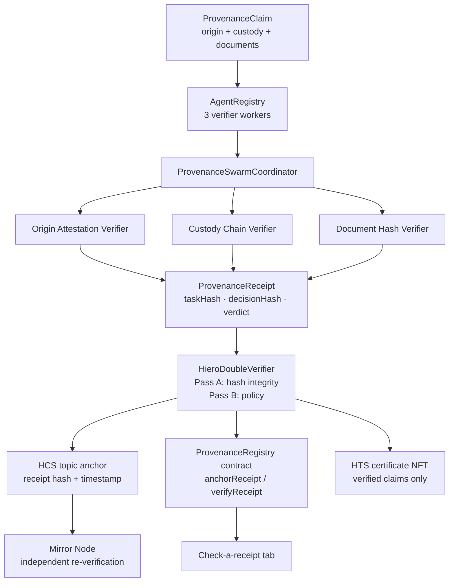

# Provenance Swarm — a Scaffold-HBAR template

Verifiable supply-chain provenance on Hedera. A deterministic agent swarm checks a product's
**origin attestation**, **custody chain**, and **document hashes**; the coordinator binds the verdicts
into a tamper-evident receipt; the receipt is anchored on Hedera (HCS topic + registry contract) and a
provenance-certificate NFT (HTS) is minted for verified claims. A Next.js frontend walks anyone through
claim → verification → receipt → anchoring, and a third party can re-verify any receipt against the
chain or the mirror node without trusting the verifier.

Scaffold it in one command:

```bash
npm create scaffold-hbar@latest -- --template livevnx8/scaffold-hbar-provenance-swarm
```

## The story in one paragraph

A buyer receives coffee claimed as organic single-origin. The seller hands over a claim: farm details,
every handoff, and document hashes. The swarm verifies each dimension deterministically — the same claim
always yields the same verdicts — and produces a receipt with `taskHash` (the claim, canonicalized and
hashed) and `decisionHash` (the claim hash bound to the worker results). That receipt is anchored on
Hedera. Weeks later, anyone holding the claim ID and decision hash can check the on-chain registry or
pull the HCS topic message from a mirror node and confirm: *this exact receipt is what was anchored*.
No trust in the original verifier required.

## Architecture



## What's inside

```
packages/
  swarm/       Deterministic agent core: workers, coordinator, receipt builder,
               double-verifier, fixture, plus Hedera adapters
               (HCS anchoring, HTS certificate minting, mirror re-verification)
  contracts/   Hardhat: ProvenanceRegistry.sol — one-anchor-per-claim registry
               with on-chain lookup and hash verification
  nextjs/      Staged UI (claim → verify → receipt → anchor), receipt inspector,
               third-party "check a receipt" tab, and API routes bridging the
               browser to the swarm core and Hedera
template.json  Scaffold-HBAR manifest (capabilities declaration)
AGENTS.md      Agent operating notes for this template
```

## How verification works

Every step is deterministic — no models, no randomness, no network calls in the verify path:

1. **Canonicalize & hash the claim** — `taskHash = sha256(canonical claim JSON)`. Any byte-level
   change to the claim changes this hash.
2. **Run the three workers** — each recomputes the hash it is responsible for and compares:
   - *Origin Attestation Verifier* recomputes `sha256(farm|region|harvestDate|statement)`.
   - *Custody Chain Verifier* recomputes each `sha256(prevHolder|holder|receivedAt)` and checks
     the chain links end-to-end.
   - *Document Hash Verifier* checks every document hash is well-formed 64-char hex.
3. **Build the receipt** — `decisionHash = sha256(taskHash + worker results)`. The verdict is
   `verified` only if every worker passes.
4. **Double-verify** — two independent passes must agree: Pass A re-derives both hashes from the
   claim; Pass B checks verdict/worker consistency. A tampered claim is *truthfully recorded* as
   `needs_review` — the receipt never lies about what it saw.

## Quick start (no Hedera account needed)

```bash
npm install
npm run demo --workspace @provenance-swarm/swarm   # credential-free demo: valid claim + tamper demo
npm test --workspace @provenance-swarm/swarm       # 25 unit tests, all offline
```

Run the frontend:

```bash
npm run dev --workspace @provenance-swarm/nextjs    # http://localhost:3000
```

The UI runs fully offline until you add Hedera credentials — the header badge reads
"Offline demo mode" vs "Hedera testnet connected", and the anchor panel explains exactly what to
configure. Click **Load coffee fixture** → **Run verification** to see the whole flow in seconds.

## Hedera services in play

| Service | Role | Where |
|---|---|---|
| Smart Contract Service | `ProvenanceRegistry` stores `decisionHash` per claim; `verifyReceipt` lets anyone check a presented receipt on-chain | `packages/contracts`, `/api/anchor`, `/api/contract-verify` |
| HCS | Receipt hash anchored as a topic message — public, timestamped proof of existence | `packages/swarm/src/hedera.ts`, `/api/anchor` |
| HTS | Provenance-certificate NFT minted per verified claim, carrying the decision hash | `packages/swarm/src/hedera.ts`, `/api/anchor` |
| Mirror Node | Frontend re-verifies the HCS anchor via public mirror REST; every step links out to HashScan | `packages/swarm/src/mirror.ts`, `/api/mirror-verify` |

### Environment

Copy `packages/nextjs/.env.example` to `packages/nextjs/.env`:

| Variable | Required for | Notes |
|---|---|---|
| `HEDERA_OPERATOR_ID` / `HEDERA_OPERATOR_KEY` | any on-chain step | Testnet credentials only; never commit |
| `HEDERA_NETWORK` | anchoring | `testnet` (default) or `mainnet` |
| `HEDERA_PROVENANCE_TOPIC_ID` | HCS anchor | auto-created if absent |
| `HEDERA_CERTIFICATE_TOKEN_ID` | NFT mint | auto-created if absent |
| `HEDERA_REGISTRY_ADDRESS` | contract anchor + receipt checks | from `deploy:testnet` |
| `HEDERA_RPC_URL` | contract calls | defaults to Hashio testnet |

## Going to testnet

1. Create a testnet account via the [Hedera Portal](https://portal.hedera.com) and fund it from the faucet.
2. Copy `packages/nextjs/.env.example` to `packages/nextjs/.env` and add your operator credentials.
3. Deploy the registry: `npm run deploy:testnet --workspace @provenance-swarm/contracts`
4. Run the full claim flow in the frontend: verify → anchor → verify on mirror node.
5. Record the transaction hashes below.

**Verified testnet transactions** — the template's HCS + HTS adapters have already run live
on testnet (full notes: [`vera-nft/LIVE_RUN.md`](./vera-nft/LIVE_RUN.md)):

| Step | Transaction | HashScan link |
|---|---|---|
| Receipt anchor (HCS) | `0.0.9032608@1789565505.352869642` (topic `0.0.10569989`, seq 2) | [transaction](https://hashscan.io/testnet/transaction/0.0.9032608@1789565505.352869642) · [topic](https://hashscan.io/testnet/topic/0.0.10569989) |
| Certificate NFT mint (HTS) | `0.0.9032608@1789565511.702573940` (token `0.0.10569997`, serial #1) | [transaction](https://hashscan.io/testnet/transaction/0.0.9032608@1789565511.702573940) · [token](https://hashscan.io/testnet/token/0.0.10569997) |
| Registry deployment | _pending — runs in the build window_ | _pending_ |

A fresh end-to-end run from the published template (verify → anchor → mirror re-verify,
including the registry deployment) will be recorded here during the build window.

## API routes (frontend backend)

| Route | Purpose |
|---|---|
| `POST /api/verify` | Runs the swarm over a claim; returns `{ receipt, report }` — fully offline |
| `POST /api/anchor` | Anchors a receipt: HCS topic message, registry contract record, HTS certificate mint |
| `POST /api/contract-verify` | Third-party check: does the on-chain anchor match this claim ID + decision hash? |
| `POST /api/mirror-verify` | Re-fetches the HCS topic message from the mirror node and compares decision hashes |
| `GET /api/config` | Which Hedera features are configured (no secrets leak to the browser) |
| `GET /api/fixture` | The valid coffee-shipment fixture claim |

## Testing

```bash
npm test --workspace @provenance-swarm/swarm       # 25 tests: workers, coordinator, receipts,
                                                   # double-verifier, mirror helper (stubbed fetch)
npm test --workspace @provenance-swarm/contracts   # 5 tests: anchor/lookup/verify, one-anchor rule
npm run build --workspace @provenance-swarm/nextjs  # production build must compile clean
```

## Honest boundaries

- The verifier workers are **deterministic scoring logic**, not AI models. The "agent swarm" framing
  refers to the worker/coordinator/registry architecture with verifiable receipts.
- Live Hedera behavior is demo-grade until the registry deployment and the fresh published-template
  run above are recorded with real transaction hashes. Everything else in this repo is verified by the
  offline test suites, which need no credentials.
- The double-verifier is two independent verification *passes* over the same receipt, not two
  independent external systems.
- Hash-chained receipts and mirror re-verification are solid engineering, not novel cryptography.

## License

MIT — see [LICENSE](./LICENSE).
