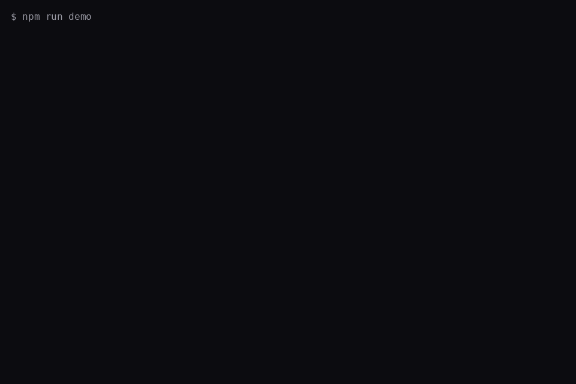

# Provenance Swarm: a Scaffold-HBAR template



Check a supply-chain claim offline, then anchor a tamper-evident receipt on Hedera testnet.

## What this scaffold is

A Next.js + Hardhat monorepo for Scaffold-HBAR. Three deterministic checks (origin, custody,
documents, plus a Chainlink price check when a claim declares a value) turn a product claim
into a receipt whose hashes change if anything in the claim changes. A verified receipt is
anchored three ways on Hedera: an HCS topic message, a `ProvenanceRegistry` smart contract
record, and an HTS certificate NFT. Anyone can re-check it later against the public mirror
node or the contract.

## Run it

Needs Node >= 20.18.3. No Hedera account is needed for the demo.

```bash
npx create-scaffold-hbar@latest my-provenance-swarm \
  --template livevnx8/scaffold-hbar-provenance-swarm --package-manager npm \
  --solidity-framework hardhat --ci
cd my-provenance-swarm
npm install        # already done by the scaffold; needed on a plain git clone
npm run build      # required once: the packages import each other's build output
npm run demo       # offline: two GREEN claims, then four refusal cases (RED)
npm run dev --workspace @provenance-swarm/nextjs   # http://localhost:3000
```

The UI works offline: load the coffee fixture, run verification, then try **Tamper
attestation** to watch a claim get refused. `npm run test` and `npm run lint` run the
offline test suites and lint.

**To anchor on testnet**, copy `packages/nextjs/.env.example` to `packages/nextjs/.env` and set:

- `HEDERA_OPERATOR_ID`, `HEDERA_OPERATOR_KEY` (testnet only; `HEDERA_KEY_TYPE=ecdsa` for
  ECDSA keys)
- `HEDERA_REGISTRY_ADDRESS` from `npm run deploy:testnet --workspace @provenance-swarm/hardhat`
- `HEDERA_CERTIFICATE_TOKEN_ID` from `npm run init:token -- --env packages/nextjs/.env`
- `ANCHOR_API_TOKEN` (16+ characters). Anchoring spends your HBAR, so the anchor route stays
  off without it; paste the same token into the anchor panel.

Full setup and error codes: [docs/going-to-testnet.md](./docs/going-to-testnet.md).

## Check it yourself

- Operator allowlist: `0.0.9034044`, `0.0.10685865`
- Receipt topic: [`0.0.10681528`](https://hashscan.io/testnet/topic/0.0.10681528)
- Registry (current): [`0xd564…5f55`](https://hashscan.io/testnet/contract/0xd564579399aAc654CcB5C5F768679471aa795f55),
  deployed in [`0xdc4b903e…`](https://hashscan.io/testnet/transaction/0xdc4b903ea7385bede39dc433023ebb0dfb44d50dfcf10c2404b3250b5e9eec5d)
- Latest HCS anchor: [`0.0.9034044@1790201046.181965496`](https://hashscan.io/testnet/transaction/0.0.9034044@1790201046.181965496)
  (seq 7), with certificate NFT mint [`0.0.9034044@1790201052.128733096`](https://hashscan.io/testnet/transaction/0.0.9034044@1790201052.128733096)

```bash
curl -s https://testnet.mirrornode.hedera.com/api/v1/topics/0.0.10681528/messages/7
```

A message counts only if `payer_account_id` is on the allowlist (the topic is open, so anyone
can post to it). Then base64-decode `message` and compare its `decisionHash` with the receipt.

## What it does not prove

It proves the claim is internally consistent and unchanged since it was anchored. It does not
prove the claim is true in the real world, and the registry records what the operator chose
to anchor. Details: [docs/how-it-works.md](./docs/how-it-works.md).

## More information

- [Walkthrough](./docs/walkthrough.md): the guided path, each demo step, extensions
- [How it works](./docs/how-it-works.md): architecture, hashing, trust model, API routes, tests
- [Going to testnet](./docs/going-to-testnet.md): environment, anchor auth, setup, error codes
- [Testnet evidence](./docs/testnet-evidence.md): every transaction, superseded instances
- [Multi-ledger anchors](./docs/multi-ledger-anchors.md), [oracle design](./docs/phase-2-oracle-design.md),
  [history appendix](./docs/history/window-9/appendix.md), [AGENTS.md](./AGENTS.md)

MIT licensed. See [LICENSE](./LICENSE).
