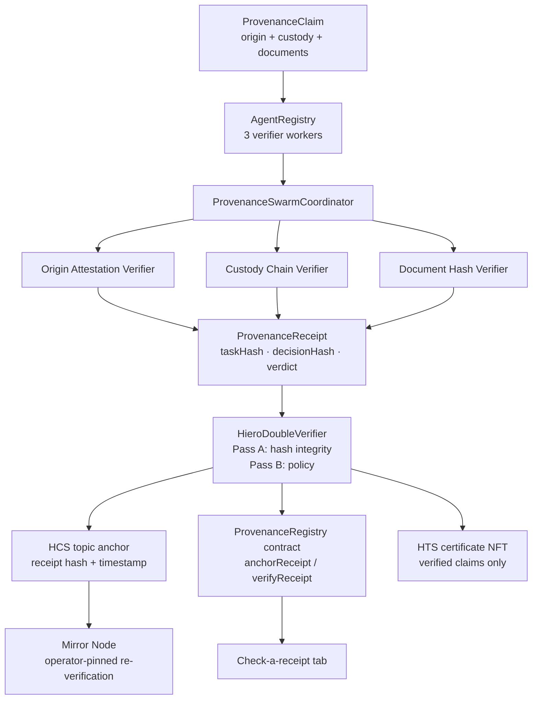

# How it works

Architecture, hashing, the trust model, API routes, tests, and honest limits. Back to the [README](../README.md).

## Why it matters

The swarm pattern separates independently testable verification responsibilities while keeping the final provenance receipt deterministic and reproducible.

### What this does not prove

- **Not real-world truth.** A self-consistent fabricated claim (hashes that recompute and
  match the supplied fields) gets a full GREEN. The system proves internal consistency of
  the fields you supply, not signer identity, source authentication, document retrieval, or
  custody attestation from the outside world.
- **Mirror confirmation is byte equality from an allowlisted operator.**
  `verifyHcsAnchorOnMirror` checks that the HCS message sits on the receipt topic, was paid
  for by an account on the operator allowlist (both from server config:
  `HEDERA_MIRROR_TOPIC_ID`, `HEDERA_MIRROR_ALLOWED_PAYERS`, defaulting to `0.0.10681528` and
  `0.0.9034044,0.0.10685865`; never from the request or receipt), and that its
  `decisionHash` equals the expected hash. It
  does not independently reconstruct the claim or recompute provenance.
- **Document hashes are shape-checked only.** The Document Hash Verifier accepts lowercase
  64-char hex strings. It never obtains or hashes document bytes, so it does not authenticate
  document contents.

## How the infrastructure fits together

Five layers, each checkable on its own. Layers 1-3 are the core pattern from the
90-second path; layers 4-5 are advanced extensions.

**1. The swarm (offline, deterministic).** Three separate checks each look at one
part of the claim: origin attestation (do the hashes recompute from the supplied fields?),
custody chain (is every handoff intact?), document hashes (are they well-formed
64-char hex?). The coordinator binds the three verdicts into a receipt.
`taskHash = sha256(canonical claim)` identifies the claim;
`decisionHash = sha256(canonical {version, taskHash, workers})` binds the
claim to the verdicts. Same claim in, same verdict out: no network, no
randomness, no credentials. A tampered claim verifies to `needs_review` with
the refusing worker named, and the receipt records that truthfully.

**2. Hedera anchors (the trust root).** A verified receipt is anchored three
ways on Hedera testnet: the receipt goes out as an HCS topic message, the
`decisionHash` is stored per claim in the `ProvenanceRegistry` smart contract
(which enforces one anchor per claim and refuses duplicates), and a
provenance-certificate NFT (HTS) is minted for verified claims only.
`needs_review` claims anchor the refusal but mint nothing.

**3. Mirror re-verification (trust, but re-read).** The server re-fetches the
HCS message from the public mirror node, checks that it is on the receipt topic and was
paid for by an account on the operator allowlist, and byte-compares the `decisionHash`.
Anyone can run the same query against the public mirror node without our server, using the
published allowlist and topic.

**4. Cross-chain attestations (extension: the receipt travels).** The same proof envelope
(claim ID, verdict, decision hash, task hash, HCS sequence, consensus
timestamp) is attested on XRPL and Solana: memo-carrying transactions whose
payloads byte-match the Hedera anchor. Field-proven scripts live in
`packages/anchors/scripts/`.

**5. The universal checker (extension).** One script takes any attestation, an XRPL hash or
a Solana signature, re-reads the foreign transaction, decodes the envelope, and back-checks every field against Hedera: HCS message,
registry `verifyReceipt`, Chainlink oracle for value claims. 12 checks per
attestation, 13 for value claims. If anything drifts, it fails loudly.

## Architecture



## What's inside

```
packages/
  swarm/       Deterministic agent core: workers, coordinator, receipt builder,
               double-verifier, fixture, plus Hedera adapters
               (HCS anchoring, HTS certificate minting, mirror re-verification)
  oracle/      Chainlink-style value-attestation oracle: feed readers, deterministic
               verifier, worker pipeline, compositor, runnable demo plan
  anchors/     Multi-ledger evidence anchors: ledger-agnostic anchor interface,
               field-proven XRPL/Solana keyed-run scripts + universal checker
               (packages/anchors/scripts/), fail-closed in-app adapters
  hardhat/     Hardhat: ProvenanceRegistry.sol, the operator-gated
               one-anchor-per-claim registry with on-chain lookup and hash
               verification
  nextjs/      Staged UI (claim → verify → receipt → anchor), receipt inspector,
               third-party "check a receipt" tab (receipts and cross-chain
               attestations), and API routes bridging the
               browser to the swarm core and Hedera
template.json  Scaffold-HBAR manifest. Lives at the repo root by design; the CLI reads it from there (it is intentionally not copied into the scaffolded tree)
AGENTS.md      Agent operating notes for this template
```

## How verification works

Every step is deterministic: no models, no randomness, no network calls in the verify path.

1. **Canonicalize and hash the claim**: `taskHash = sha256(canonical claim JSON)`. Any
   byte-level change to the claim changes this hash.
2. **Run the three workers**: each recomputes the hash it is responsible for and compares:
   - *Origin Attestation Verifier* recomputes `attestationHashFor(farm, region, harvestDate,
     statement)`, a canonical JSON tuple, never a delimiter-joined string.
   - *Custody Chain Verifier* recomputes each `handoffHashFor(prevHolder, holder, receivedAt)`
     and checks the chain links end-to-end.
   - *Document Hash Verifier* checks every document hash is well-formed 64-char hex.
3. **Build the receipt** (version `1.1`): `decisionHash = sha256(canonical {v, taskHash,
   workers})` where workers are sorted by `workerId`, confidence is a fixed-point
   integer (basis points), and findings are hashed as JSON array elements. Version `1.0`
   receipts (legacy delimiter-framed payload) remain verifiable; the verifier recomputes
   per `receipt.version` and rejects unknown versions. The verdict
   is `verified` only if every worker passes.
4. **Double-verify**: two check groups must both pass: Pass A re-derives both hashes from
   the claim; Pass B checks verdict/worker consistency. The groups are not independent
   verifiers; both run inside the one `verifyProvenanceReceipt` call, and disagreement
   is reject-on-any-fail. A tampered claim is *truthfully
   recorded* as `needs_review`. The receipt never lies about what it saw.
5. **Anchor gate**: `POST /api/anchor`, in order, **before** any HCS, registry, or NFT write:
   - requires `Authorization: Bearer <ANCHOR_API_TOKEN>` (constant-time compare). The route
     is disabled (HTTP 503) while `ANCHOR_API_TOKEN` is unset or shorter than 16
     characters, or when `ANCHOR_API_ENABLED=false`; a wrong or missing token gets 401;
   - requires the original claim and re-runs `verifyProvenanceReceipt` (and a fresh
     `verifyClaim`). Forged "verified" receipts are rejected with HTTP 403;
   - for claims with Chainlink evidence, re-reads every committed round on the server with
     `getRoundData(roundId)` on the pinned proxy and rejects any field mismatch, unknown
     feed, or round older than 24 hours (403; 502 if the feed cannot be read). The price
     data in the posted claim is never trusted on its own;
   - requires `HEDERA_REGISTRY_ADDRESS` (without the registry, one-anchor-per-claim is
     unenforceable, so the route fails closed with 400) and reads `getAnchor(claimId)` so a
     duplicate gets 409 before an HCS message is paid for.

   Receipts that fail verification are never minted an NFT; `needs_review` receipts may
   still be anchored with their verdict truthfully recorded.

## Check-a-receipt honesty

`POST /api/contract-verify` supports two modes:

- **claim-reverified** (preferred): post the claim; the server recomputes `decisionHash`
  before comparing to the registry.
- **hash-equality-only**: post only `claimId` + `decisionHash`. A match proves the registry
  holds that hash for that claim ID (anchored once, by the operator, one anchor per claim).
  It does **not** prove claim ownership. The response `note` field says so explicitly.

## Hedera services in play

| Service | Role | Where |
|---|---|---|
| Smart Contract Service | `ProvenanceRegistry` stores `decisionHash` per claim (operator-gated anchoring, one-anchor-per-claim); `verifyReceipt` lets anyone check a presented receipt on-chain | `packages/hardhat`, `/api/anchor`, `/api/contract-verify` |
| HCS | Receipt hash anchored as a topic message: public, timestamped proof of existence | `packages/swarm/src/hedera.ts`, `/api/anchor` |
| HTS | Provenance-certificate NFT minted per verified claim, carrying the decision hash | `packages/swarm/src/hedera.ts`, `/api/anchor` |
| Mirror Node | Frontend re-verifies the HCS anchor via public mirror REST; every step links out to HashScan | `packages/swarm/src/mirror.ts`, `/api/mirror-verify` |

### Multi-ledger evidence (scaffolding)

Anchoring goes through the ledger-neutral `@provenance-swarm/anchors` package
(`packages/anchors`): one `LedgerAnchor` interface, one explorer-URL choke point,
and per-ledger adapters. Hedera HCS is the ported reference adapter; XRPL,
Solana, and Base adapters are present but fail-closed ("Pending port") until
their ports are independently verified. Every explorer link is validated.
Malformed anchor ids and unknown networks throw instead of guessing. See
`packages/anchors/PORTING.md` and `docs/multi-ledger-anchors.md`.

## API routes (frontend backend)

| Route | Purpose |
|---|---|
| `POST /api/verify` | Runs the swarm over a claim; returns `{ receipt, report }` (fully offline) |
| `POST /api/anchor` | Requires `Authorization: Bearer <ANCHOR_API_TOKEN>` (disabled with 503 when unset or `ANCHOR_API_ENABLED=false`). Re-verifies claim+receipt, re-reads committed Chainlink rounds on-chain, checks the registry for a duplicate, then anchors: HCS topic message, registry record, HTS certificate mint |
| `POST /api/oracle-verify` | Read-only audit: re-reads every Chainlink round committed in a claim with `getRoundData` and reports field-level matches |
| `POST /api/contract-verify` | Third-party check: hash-equality-only, or claim-reverified when a claim is posted |
| `POST /api/mirror-verify` | Re-fetches the HCS message from the receipt topic and compares decision hashes; refuses messages whose payer is not on the operator allowlist (`HEDERA_MIRROR_ALLOWED_PAYERS`, default `0.0.9034044,0.0.10685865`; topic `HEDERA_MIRROR_TOPIC_ID`, default `0.0.10681528`; 503 if malformed) |
| `GET /api/config` | Which Hedera features are configured (no secrets leak to the browser) |
| `GET /api/fixture` | The valid coffee-shipment fixture claim |

## Testing

```bash
npm run build                                      # required once before per-workspace tests
npm run test --workspace @provenance-swarm/swarm       # workers, coordinator, receipts,
                                                   # double-verifier, mirror helper (stubbed fetch)
npm run test --workspace @provenance-swarm/hardhat   # anchor/lookup/verify, one-anchor rule
npm run build --workspace @provenance-swarm/nextjs  # production build must compile clean
```

## Receipt versions

- **1.1** (current): structured decision payload. `decisionHash = sha256(canonical
  {v, taskHash, workers})` with workers sorted by `workerId`, confidence as fixed-point
  integer basis points, findings as JSON array elements, version embedded. No delimiters,
  no float formatting, no order dependence. Origin/custody content hashes are canonical
  JSON tuples via `attestationHashFor` / `handoffHashFor`.
- **1.0** (legacy): `decisionHash = sha256(taskHash + ":" + workerResultsPayload)` with the
  payload delimiter-framed (`|` inside findings, `;` between workers) and confidence via
  `toFixed(4)`. Verifiable, but with a demonstrated collision class: `findings:["a|b"]`
  and `["a","b"]` hash identically, and claim-controlled strings (holder, document names,
  farm) interpolated into findings or `farm|region|...` preimages can reproduce framing
  (adversarial findings F2/F3, 2026-09-21). Kept readable so existing anchors stay checkable;
  new receipts are always 1.1.

## Honest boundaries

- The verifier workers are **deterministic scoring logic**, not AI models. The "agent swarm"
  framing refers to the worker/coordinator/registry architecture with verifiable receipts.
- Live Hedera behavior was validated on testnet (see the E2E evidence table above). Offline
  paths remain covered by the credential-free unit suites.
- The double-verifier is two *check groups* over the same receipt (A: hash integrity,
  B: policy), not two independent external systems, and not two independent passes.
  Disagreement is reject-on-any-fail. When it reports "accepted" on a `needs_review` receipt,
  that means the receipt is authentic and truthfully records `needs_review`, not that the
  claim is verified.
- Hash-chained receipts and mirror re-verification are solid engineering, not novel
  cryptography.
- Topic `0.0.10569989` is the frozen Window 9 exhibit. Template live anchors use
  `HEDERA_TEMPLATE_TOPIC_ID`.
- Fabricated but self-consistent claims, mirror confirmation, and document hashes: see
  [What this does not prove](#what-this-does-not-prove).
- `HEDERA_CERTIFICATE_TOKEN_ID` is required for NFT mint. Unlike the HCS topic (auto-created
  via `ensureTopic` when absent), `/api/anchor` does not call `createCertificateToken()`.
  Create the collection once with `npm run init:token` (writes the id into `.env`), or set
  it out-of-band. Unset token → mint fails with "No certificate token configured".
- `/api/anchor` spends the operator's HBAR. It is disabled unless `ANCHOR_API_TOKEN` is set,
  and the token is a single shared secret, not per-user auth or rate limiting. Use
  `ANCHOR_API_ENABLED=false` on public deployments that should only verify.
- The registry records what the operator anchored and when. Re-checking removes the need to
  trust the swarm's computation (anyone can recompute the hashes from the claim), not the
  need to trust the operator who chose to anchor it.
- Auto-created HCS topics have a **null submit key**: anyone who knows the topic id can
  append messages. That is intentional for a public receipt tape in this template, not a
  private channel. Set your own submit key out-of-band if you need append restriction.

## Frozen exhibit (historical appendix)

A **historical, read-only** research tape on Hedera testnet topic
`0.0.10569989`. It is **not** the template's live anchor topic: live anchors use
`HEDERA_TEMPLATE_TOPIC_ID`, and writes to `0.0.10569989` from template paths are
refused. The full exhibit (sequence table, pinned identifiers, narrative record)
lives in the appendix: [`docs/history/window-9/appendix.md`](./history/window-9/appendix.md).
